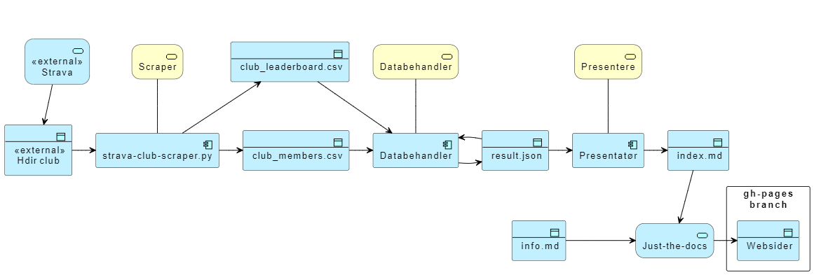

# Helsedirektoratet Strava scraper

Script og actions for å hente resultater fra Helsedirektoratet sin [stravaklubb](https://www.strava.com/clubs/754665) og publisere dette som resultatlister i forbindelse med sykle til jobben aksjonen. Resultatene oppdateres fire ganger i døgnet (klokken kl 09, 11, 18 og 00) og ligger på [websiden](https://hdir.github.io/strava-club/vaar24/).

## Arkitektur



## Komponenter

### Konfigurasjon

Konfigurasjon på tvers av python scriptene legges i [config.ini](https://github.com/hdir/strava-club/blob/main/settings/config.ini)  

### Strava club scraper

* **Trigger** Scraper startes av et [action script](https://github.com/hdir/strava-club/blob/main/.github/workflows/hdir-result.yaml), scriptet aktiveres automatisk etter en timeplan.  
* Scraper applikasjonen er en fork av [strava club scraper](https://github.com/roboes/strava-club-scraper)
  * Forutsetter at det eksisterer en bruker som er medlem i Helsedirektoratet sin stravaklubb.  
  * Scraper koden er modifisert slik at output er csv filer istedenfor Google sheets.
  * Scraper koden er modifisert slik at python scriptet kjører feilfritt i en Github Action.
  * Scraper koden er modifisert slik at brukernavn og passord ligger som hemmeligheter i repoet istedenfor som klartekst i config.ini.  
* Resultatet fra skraping legges [data\skrap](https://github.com/hdir/strava-club/blob/main/data/skrap)  

### Databehandler

Tar den siste CSV-filen fra scraper og produserer en samlet resultatliste som json.
**Trigger** Startes etter timeplan i samme workflow som skraperen, [samme script som scraper](https://github.com/hdir/strava-club/blob/main/.github/workflows/hdir-result.yaml).

* Json resultatet legges i [data\result](https://github.com/hdir/strava-club/blob/main/data/result).
* Det ligger en funksjon i databehandler som automatisk sletter data som er registrert utenom aksjonsperioden. Denne funksjonen bruker start og stopp uke definert i *settings/config.ini* som parametere.

### Presentatør

Tar resultatlisten i json fra databehandler og presenterer resultatlistene på en pen måte som html filer.
**Trigger** Startes etter timeplan i samme workflow som skraperen og databehandler, [samme script som scraper](https://github.com/hdir/strava-club/blob/main/.github/workflows/hdir-result.yaml).

Følgende lister genereres:
* Resultatliste for den siste uken.
* Resultatliste for den forrige uken.
* Akkumulert resultat for hele klubben i hele perioden.
* Akkumulert resultatliste for en bestemt periode hvor resultatene for hele perioden akkumuleres. Perioden defineres i *settings/config.ini*
  * En linje pr. deltaker med: akkumulert tid, akkumulert kilometer, akkumulert antall aktiviteter, akkumulert høydemeter og antall lodd tildelt.

Resultatet legges på gh-pages branch for visning på github.io. Presentatør skriver ingen filer til disk. All prosessering i presentatør baserer seg utelukkende på data fra resultatlisten.

Presentatør har en egen innstilling for å generere resultatliste pr team. Data for å gjøre dette har vi foreløpig ikke og funksjonen er ikke testet, så innstillingen for skal inntil videre være avslått. Sett derfor alltid TEAMS_FEATURE til false i *settings/config.ini*.

## Starte og slutt av kampanjeperiode

Instruksjoner for arrangører.  

### Kampanjestart

1. Inviter til kampanjen i god tid, med instuksjoner om deltakelse, regler og premier.
2. Se over den statiske informasjonsfilen *docs/info.md* og sjekk at den er oppdatert med rett informajon for kampanjen som skal startes.
3. Sette start og stop uker for kampanjen i *settings/config.ini* og juster om nødvendig variabelen som gir viktig informasjon til deltakere.
5. Flytte filer i datakatalog fra forrige aksjonsperiode til en backupdestinasjon, for eksempel data/kampanje_dato.
6. Resultatfilen er som standard satt til data/result/results.json og opprettes automatisk ved første kjøring i kampanjeperioden.
7. Aktiver workflow [scriptet](https://github.com/hdir/strava-club/blob/main/.github/workflows/hdir-result.yaml) for produksjon. Dette skal på på timeplan som er definert i scriptet.

## Kampanjeslutt  

1. Oppdater *docs/info.md* og variabelen i *settings/config.ini* med informasjon om at aksjonen er avsluttet. Gjør en siste deploy, slik at denne informasjonen kommer ut på gh-pages.
2. Deaktiver workflow [scriptet](https://github.com/hdir/strava-club/blob/main/.github/workflows/hdir-result.yaml) slik at det ikke kjører på timeplan. Dette må tidligst gjøres uken etter at aksjonen er avsluttet.
# Strava Club Scraper

## Description

This web-scraping tool aims to extract activities data from Strava Club to complete the lack of features of the standard Strava API. The main features are:

- Strava Club Activities scraper: imports "Recent Activity" for public or activities that the user has access to a dataset (requires a Strava account).
- Strava Club Leaderboard scraper: imports current and previous week leaderboard information (including athletes' `id`) to a dataset (requires a Strava account).
- Strava Club Members scraper: imports all members that joined a Strava Club (including athletes' `id`) to a dataset (requires a Strava account).
- Strava Club to Google Sheets importer: automatically retrieves data and updates Strava Club Activities, Leaderboard and/or Members dataset(s) into a Google Sheets (requires a Google API key).

## Strava API

This tool does not rely on the Strava API. Strava's API turned to be very limited in the recent years. For getting [List Club Activities](https://developers.strava.com/docs/reference/#api-Clubs-getClubActivitiesById), it returns only the following variables:
athlete variables: `resource_state`, `firstname` and `lastname` (first letter only);
activity variables: `name`, `distance`, `moving_time`, `elapsed_time`, `total_elevation_gain`, `type` and `workout_type`.

Given that Strava does not offer an `athlete id` variable, athletes with the same first name and first digit of the last name would not be distinguishable.

## Limitations

- Strava Club Activities scraper: the main drawback/limitation of this tool is that Strava's dashboard activity feed is very limited in the number of activities shown. Scrolling until the bottom of the page is not endless; after some scrolls the warning _"No more recent activity available. To see your full activity history, visit your Profile or Training Calendar."_ is shown.
  Strava has the `num_entries` URL query string (e.g. <https://www.strava.com/dashboard?club_id=319098&feed_type=club&num_entries=1000>), but still this string does not necessarily load the requested number of activity entries to the feed.
  This tool also requires that the athletes' activities to be scraped are either public or that the account that is scraping the club activities data has access to the activities to be scraped (by either following the athlete or by owning the activity).

- Strava Club Leaderboard scraper: the club leaderboards include only data for current and previous week; no historical data is provided by Strava. Additionally, club leaderboards display only the weekly top 100 members ([Source](https://support.strava.com/hc/en-us/articles/216918347-Clubs-on-Strava#:~:text=On%20the%20Strava%20website%2C%20club%20leaderboards%20will%20display%20the%20weekly%20top%20100%20members.%20On%20the%20mobile%20app%2C%20the%20top%2010%20members%20will%20appear%20on%20the%20weekly%20leaderboard.)).

To avoid these limitations, this tool offers an integration to Google Sheets, updating/incrementing specified scraped Strava Club(s) data for activities/leaderboard/members, keeping previously scraped data that cannot be accessed anymore in Strava Club.

## Usage

### Use case

Strava allows users to create a [Group Challenge](https://support.strava.com/hc/en-us/articles/360061360791-Group-Challenges), which is limited to up to 25 participants. To circumvent this limitation, one possible use case is to create one or multiple Strava Clubs (e.g. Cycling, Multisport, Run/Walk/Hike), adapt this script to update/increment an existing Google Sheets sheet with the club(s) activities, leaderboard and members information data. The script can be set up to run automatically on a scheduled basis on cloud platform services such as [GitHub Actions](https://github.com/features/actions) (see [GitHub Actions Workflow .yaml template](https://github.com/roboes/tools/blob/main/technology/git/github-actions-workflow/github-actions-workflow.yaml)) and [Railway](https://railway.app) (see [Dockerfile template](https://github.com/roboes/tools/blob/main/technology/docker/Dockerfile)). To connect the script to a Google Sheets file, a [Google Sheets API](https://console.cloud.google.com/apis/library/sheets.googleapis.com) .json key is required and the file needs to be shared with a [Service Account email address](https://cloud.google.com/iam/docs/service-account-overview). The Google Sheets can then be connected to a dashboard tool (e.g. Google Data Studio, Microsoft PowerBI).

### Strava settings

This tool assumes that [Strava's Display Preferences](https://www.strava.com/settings/display) are set to:

- `Units & Measurements` = "Kilometers and Kilograms"
- `Temperature` = "Celsius"
- `Feed Ordering` = "Latest Activities" ([chronological feed](https://support.strava.com/hc/en-us/articles/115001183630-Feed-Ordering))

And that your Strava display language is `English (US)`. To change the language, log in to [Strava](https://www.strava.com) and on the bottom right-hand corner of any page, select `English (US)` from the drop-down menu (more on this [here](https://support.strava.com/hc/en-us/articles/216917337-Changing-your-language-in-the-Strava-App)).

### Python dependencies

```.ps1
python -m pip install pyjanitor python-dateutil geopy google-api-python-client google-auth lxml pandas selenium webdriver-manager
```

### Functions

#### `strava_club_activities`

```.py
strava_club_activities(club_ids, filter_activities_type, filter_date_min, filter_date_max, timezone='UTC')
```

##### Description

- Scraps and imports activities belonging to one or multiple Strava Club(s) (public activities or activities that the account that is scraping the data has access to) to a dataset.

##### Parameters

- `club_ids`: _str list_. List of Strava Club ids in which the tool should scrap data from (e.g. `club_ids=['445017', '789955', '1045852']`).
- `filter_activities_type`: _str list_, default: _None_. List of activities type filter (e.g. `filter_activities_type=['E-Bike Ride', 'Hike', 'Ride', 'Run', 'Walk']`).
- `filter_date_min`: _str_. Start date filter (e.g. `filter_date_min='2023-06-05'`).
- `filter_date_max`: _str_. End date filter (e.g. `filter_date_max='2023-07-30'`).
- `timezone`: _str or timezone object_, default: _'UTC'_.

<br>

#### `strava_club_members`

```.py
strava_club_members(club_ids, club_members_teams=None, timezone='UTC')
```

##### Description

- Scraps and imports members of one or multiple Strava Club(s) to a dataset.

##### Parameters

- `club_ids`: _str list_. List of Strava Club ids in which the tool should scrap data from (e.g. `club_ids=['445017', '789955', '1045852']`).
- `club_members_teams`: _dict_, default: _None_. Option to add `athlete_id` to one or multiple teams (stored in the `athlete_team` column). `athlete_id` assigned to multiple teams will have its unique teams assignment comma separated.
- `timezone`: _str or timezone object_, default: _'UTC'_.

Example of `club_members_teams`:

```.py
club_members_teams={
    'Team A': ['1234, 5678'],
    'Team B': ['1234, 12345'],
}
```

<br>

#### `strava_club_leaderboard`

```.py
strava_club_leaderboard(club_ids, filter_date_min, filter_date_max, timezone='UTC')
```

##### Description

- Scraps and imports leaderboard of one or multiple Strava Club(s) to a dataset.

##### Parameters

- `club_ids`: _str list_. List of Strava Club ids in which the tool should scrap data from (e.g. `club_ids=['445017', '789955', '1045852']`).
- `filter_date_min`: _str_. Start date filter (e.g. `filter_date_min='2023-06-05'`).
- `filter_date_max`: _str_. End date filter (e.g. `filter_date_max='2023-07-30'`).
- `timezone`: _str or timezone object_, default: _'UTC'_.

<br>

#### `strava_club_to_google_sheets`

```.py
strava_club_to_google_sheets(df, sheet_id, sheet_name)
```

##### Description

- Update/increment a Google Sheet sheet given an inputted dataset.

##### Parameters

- `df`: _DataFrame_. Input dataset to be updated/incremented in a specified Google Sheets sheet.
- `sheet_id`: _str_. Google Sheets file id.
- `sheet_name`: _str_. Google Sheets sheet/tab where the data should be updated/incremented.

<br>

#### `execution_time_to_google_sheets`

```.py
execution_time_to_google_sheets(sheet_id, sheet_name, timezone='UTC')
```

##### Description

- Update a Google Sheet sheet given the current time that the code was executed.

##### Parameters

- `sheet_id`: _str_. Google Sheets file id.
- `sheet_name`: _str_. Google Sheets sheet/tab where the data should be updated/incremented.
- `timezone`: _str or timezone object_, default: _'UTC'_.

<br>

#### `strava_export_gpx`

```.py
strava_export_activities(activities_id, file_type)
```

##### Description

- Export a list of _activity_id_ to a GPS file.

##### Parameters

- `activities_id`: _int list_ or _str list_. List of activity_id to be exported (e.g. `activities_id=[696657036, 696657037]`).
- `file_type`: _str_, default: _'.gpx'_. Activity export format. Note that the _'.gpx'_ format uses Strava's built-in feature to export the activities, and _'.tcx'_ uses [Sauce for Strava Chrome Extension](https://chrome.google.com/webstore/detail/sauce-for-strava/eigiefcapdcdmncdghkeahgfmnobigha) (which needs to be installed on Selenium's WebDriver to work). Strava's built-in export .gpx feature includes only trackpoints (with latitude and longitude); it is possible to manipulate those .gpx exports by converting them to other GPS file types (e.g. .tcx) and add faketimes using [GPSBabel](https://www.gpsbabel.org) (see [gps_tools.sh](https://github.com/roboes/tools/blob/main/sports/gps_tools.sh)).

<br>

#### `selenium_webdriver_quit`

```.py
selenium_webdriver_quit()
```

##### Description

- Terminates the WebDriver session.

##### Parameters

- None.

## Legal

Please note that the use of this code/tool may not comply with [Strava's Terms of Service](https://www.strava.com/legal/terms) (especially the _"Distributing, or disclosing any part of the Services in any medium, including without limitation by any automated or non-automated “scraping”"_ term) and [Strava's API Agreement](https://www.strava.com/legal/api) (especially the _"You may not use web scraping, web harvesting, or web data extraction methods to extract data from the Strava Platform"_ term). Use this tool at your own risk.

## See also

[Strava Club Tracker](https://github.com/picasticks/StravaClubTracker): Tool that generates a progress tracker/dashboard for Club activities (relies on Strava's API) (HTML, PHP).

[StravaClubActivities](https://github.com/stephenwong/strava_club_activities): Tool that downloads Club activities and generates a .csv for processing virtual race events (relies on Strava's API) (Ruby).
