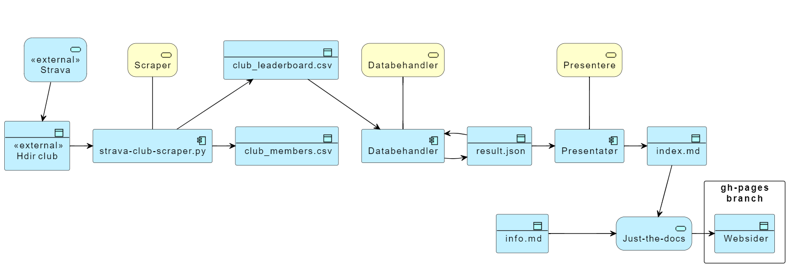

# Helsedirektoratet Strava scraper

Script og actions for å hente resultater fra Helsedirektoratet sin [stravaklubb](https://www.strava.com/clubs/754665) og publisere dette som resultatlister i forbindelse med sykle til jobben aksjonen. Resultatene oppdateres fire ganger i døgnet (klokken kl 09, 11, 18 og 00) og ligger på [websiden](https://hdir.github.io/strava-club/vaar24/).

## Arkitektur

## Komponenter

### Konfigurasjon

Konfigurasjon på tvers av python scriptene legges i [config.ini](https://github.com/hdir/strava-club/blob/main/settings/config.ini)  

### Strava club scraper

* **Trigger** Scraper startes av et [action script](https://github.com/hdir/strava-club/blob/main/.github/workflows/hdir-result.yaml), scriptet aktiveres automatisk etter en timeplan.  
* Scraper applikasjonen er en fork av [strava club scraper](https://github.com/roboes/strava-club-scraper)
  * Forutsetter at det eksisterer en bruker som er medlem i Helsedirektoratet sin stravaklubb.  
  * Scraper koden er modifisert slik at output er csv filer istedenfor Google sheets.
  * Scraper koden er modifisert slik at python scriptet kjører feilfritt i en Github Action.
  * Scraper koden er modifisert slik at brukernavn og passord ligger som hemmeligheter i repoet istedenfor som klartekst i config.ini.  
* Resultatet fra skraping legges [data\skrap](https://github.com/hdir/strava-club/blob/main/data/skrap)  

### Databehandler

Tar den siste CSV-filen fra scraper og produserer en samlet resultatliste som json.
**Trigger** Startes etter timeplan i samme workflow som skraperen, [samme script som scraper](https://github.com/hdir/strava-club/blob/main/.github/workflows/hdir-result.yaml).

* Json resultatet legges i [data\result](https://github.com/hdir/strava-club/blob/main/data/result).
* Det ligger en funksjon i databehandler som automatisk sletter data som er registrert utenom aksjonsperioden. Denne funksjonen bruker start og stopp uke definert i *settings/config.ini* som parametere.

### Presentatør

Tar resultatlisten i json fra databehandler og presenterer resultatlistene på en pen måte som html filer.
**Trigger** Startes etter timeplan i samme workflow som skraperen og databehandler, [samme script som scraper](https://github.com/hdir/strava-club/blob/main/.github/workflows/hdir-result.yaml).

Følgende lister genereres:
* Resultatliste for den siste uken.
* Resultatliste for den forrige uken.
* Akkumulert resultat for hele klubben i hele perioden.
* Akkumulert resultatliste for en bestemt periode hvor resultatene for hele perioden akkumuleres. Perioden defineres i *settings/config.ini*
  * En linje pr. deltaker med: akkumulert tid, akkumulert kilometer, akkumulert antall aktiviteter, akkumulert høydemeter og antall lodd tildelt.

Resultatet legges på gh-pages branch for visning på github.io. Presentatør skriver ingen filer til disk. All prosessering i presentatør baserer seg utelukkende på data fra resultatlisten.

Presentatør har en egen innstilling for å generere resultatliste pr team. Data for å gjøre dette har vi foreløpig ikke og funksjonen er ikke testet, så innstillingen for skal inntil videre være avslått. Sett derfor alltid TEAMS_FEATURE til false i *settings/config.ini*.

## Starte og slutt av kampanjeperiode

Instruksjoner for arrangører.  

### Kampanjestart

1. Inviter til kampanjen i god tid, med instuksjoner om deltakelse, regler og premier.
2. Se over den statiske informasjonsfilen *docs/info.md* og sjekk at den er oppdatert med rett informajon for kampanjen som skal startes.
3. Sette start og stop uker for kampanjen i *settings/config.ini* og juster om nødvendig variabelen som gir viktig informasjon til deltakere.
5. Flytte filer i datakatalog fra forrige aksjonsperiode til en backupdestinasjon, for eksempel data/kampanje_dato.
6. Resultatfilen er som standard satt til data/result/results.json og opprettes automatisk ved første kjøring i kampanjeperioden.
7. Aktiver workflow [scriptet](https://github.com/hdir/strava-club/blob/main/.github/workflows/hdir-result.yaml) for produksjon. Dette skal på på timeplan som er definert i scriptet.

## Kampanjeslutt  

1. Oppdater *docs/info.md* og variabelen i *settings/config.ini* med informasjon om at aksjonen er avsluttet. Gjør en siste deploy, slik at denne informasjonen kommer ut på gh-pages.
2. Deaktiver workflow [scriptet](https://github.com/hdir/strava-club/blob/main/.github/workflows/hdir-result.yaml) slik at det ikke kjører på timeplan. Dette må tidligst gjøres uken etter at aksjonen er avsluttet.
